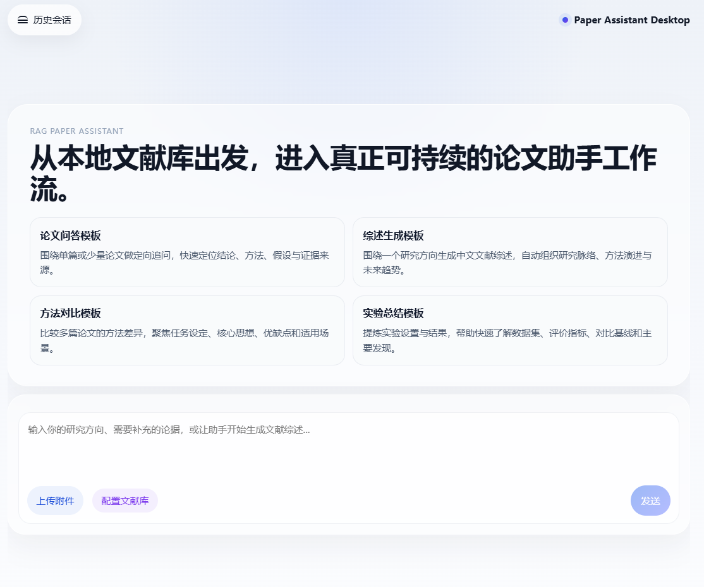
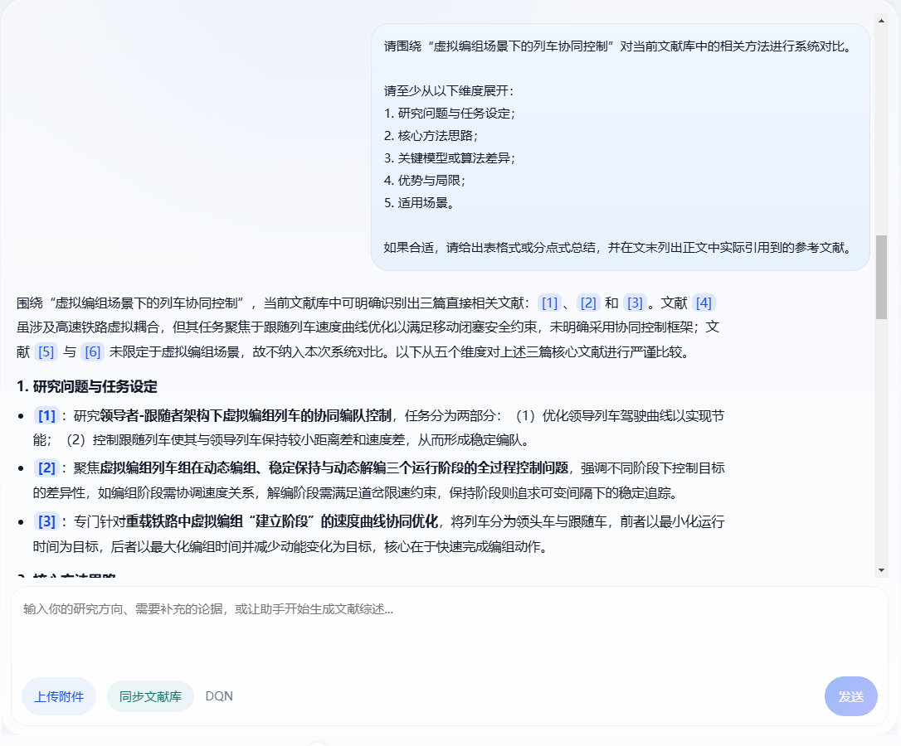
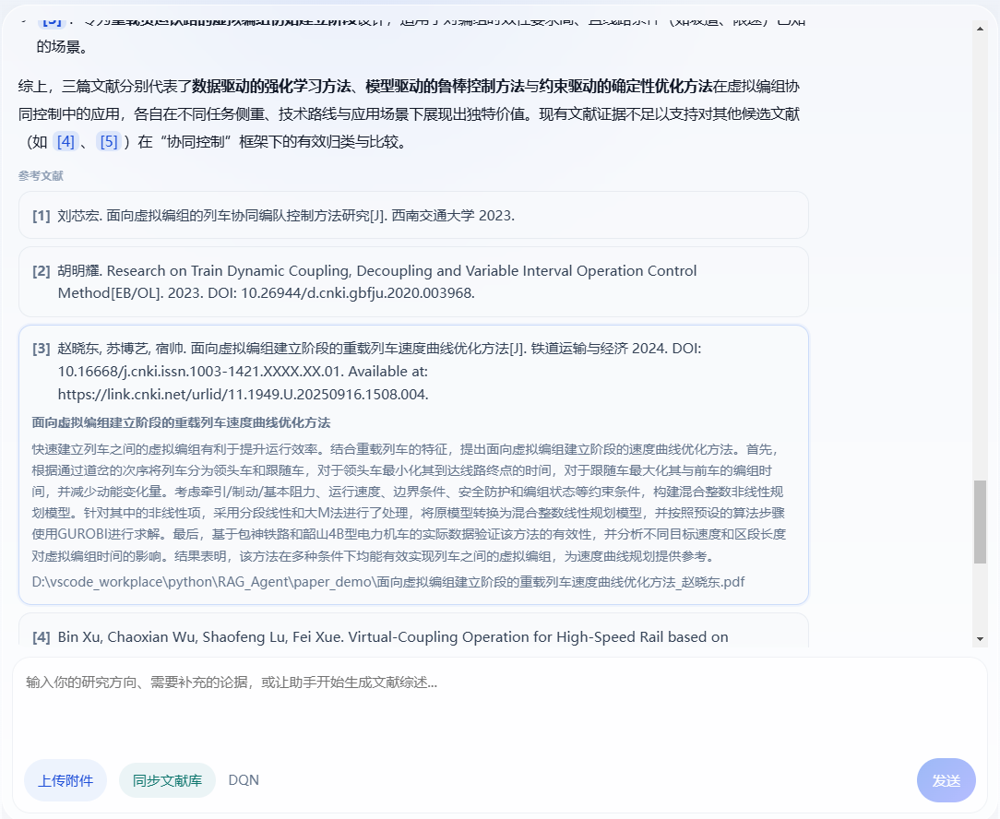
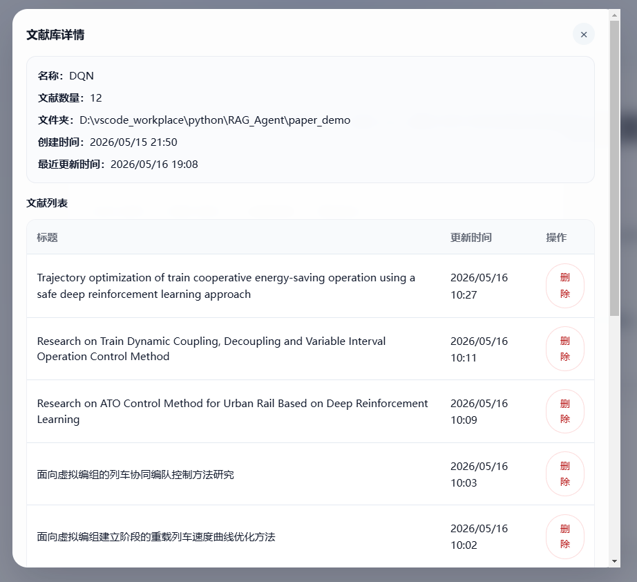
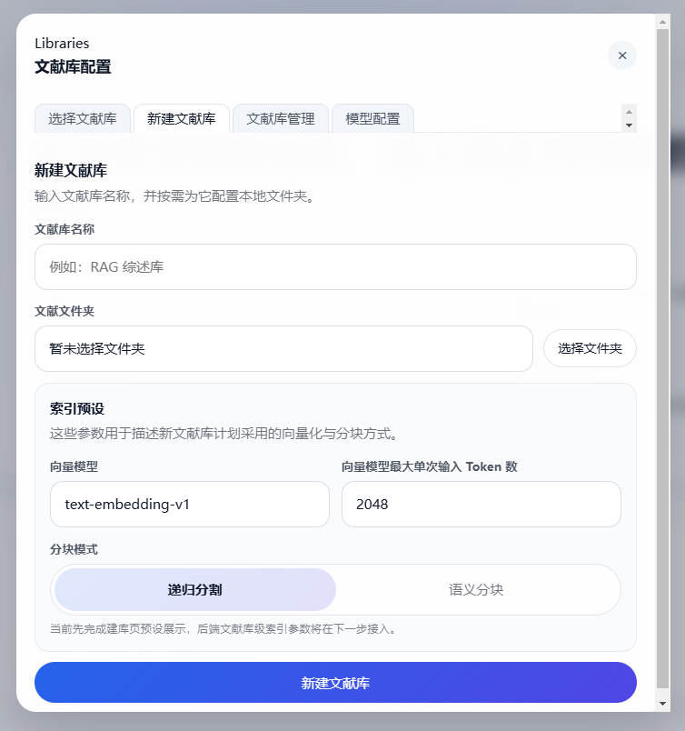
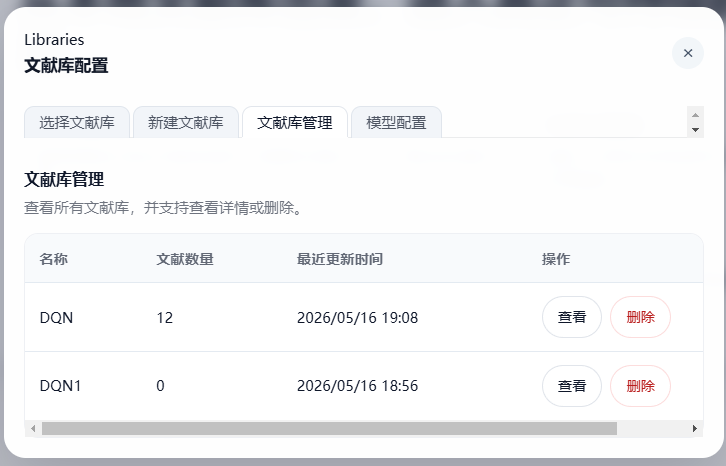

# RAG Paper Assistant

一个面向本地论文库的桌面论文助手项目，提供：

- 文献库管理与本地 PDF 同步
- 基于向量检索的论文问答
- 参考文献展示与引用绑定
- Electron + Vue 桌面端交互界面

# 项目预览

<!-- ...existing code... -->
<table style="border-collapse: collapse; border: none;">

  <tr>
    <td style="border: none;"></td>
    <td style="border: none;"></td>
    <td style="border: none;"></td>
  </tr>
    <tr>
    <td style="border: none;"></td>
    <td style="border: none;"></td>
    <td style="border: none;"></td>
  </tr>
</table>
<!-- ...existing code... -->
## 项目结构

```text
.
├─ app_backend/            # 后端服务、仓储、数据库与检索逻辑
├─ rag-paper-assistant/     # Electron + Vue 前端桌面应用
├─ upload_api.py           # FastAPI 入口
├─ config_data.py          # 运行目录与默认配置
├─ requirements.txt        # Python 依赖
└─ package.json            # 根目录前端脚本代理
```

## 环境要求

- Python 3.11 或更高版本
- Node.js 18 或更高版本
- npm 9 或更高版本

## 后端启动

1. 创建并激活虚拟环境

```powershell
python -m venv .venv
.venv\Scripts\Activate.ps1
```

2. 安装 Python 依赖

```powershell
pip install -r requirements.txt
```

3. 配置环境变量

项目默认通过 `config_data.py` 读取 `DASHSCOPE_API_KEY` 作为模型 API Key。你可以在系统环境变量中配置，或者在本地 `.env` 文件中配置：

```env
DASHSCOPE_API_KEY=your_api_key_here
```

4. 启动后端服务

```powershell
uvicorn upload_api:app --reload
```

默认地址：

- `http://127.0.0.1:8000`

## 前端 / 桌面端启动

1. 安装前端依赖

```powershell
cd rag-paper-assistant
npm install
cd ..
```

2. 从项目根目录启动桌面应用

```powershell
npm run dev
```

常用命令：

- `npm run dev`：启动 Electron + Vue 开发环境
- `npm run build`：构建桌面端产物
- `npm run build:backend`：使用 PyInstaller 构建后端可执行文件
- `npm run pack`：生成不安装的桌面应用目录
- `npm run dist`：生成 Windows 安装包
- `npm run lint`：执行前端 lint
- `npm run type-check`：执行前端类型检查

## 数据目录说明

项目运行过程中会在 `config_data.py` 指定的位置创建本地数据目录，用于保存：

- SQLite 数据库
- Chroma 向量索引
- 运行时配置文件

这些运行产物通常不建议提交到 Git 仓库。

## 当前能力说明

- 元数据提取由大语言模型完成
- 默认分块方式为递归分割
- 文献库支持独立的向量模型、最大输入长度与分块模式配置
- 语义分块配置项已预留，但当前运行时仍回退到递归分割

## Windows 桌面安装包发布

当前项目已经接入 Windows 桌面发布链路：

1. 前端使用 Electron + Vite 构建
2. 后端使用 PyInstaller 打包为本地可执行文件
3. 生产模式下 Electron 会自动拉起内置后端

首次发布前请先安装依赖：

```powershell
pip install -r requirements.txt
cd rag-paper-assistant
npm install
cd ..
```

然后在项目根目录执行：

```powershell
npm run dist
```

生成结果默认位于：

```text
rag-paper-assistant/release/
```

补充说明：

- 打包后的桌面应用会自动启动内置 Python 后端
- 运行数据会写入桌面应用对应的用户数据目录，而不是安装目录

## 开发说明

- 后端核心代码位于 `app_backend/`
- 前端核心界面位于 `rag-paper-assistant/src/App.vue`
- 如果你准备开源该项目，建议同时保留 `.gitignore`，避免提交数据库、向量库、构建产物和缓存文件
