# RAG Paper Assistant

一个面向**本地论文库**的桌面论文问答（RAG）助手，提供：

- **文献库管理**：多文献库、本地文件夹绑定、增量 PDF 同步（SHA256 去重、后台任务与进度轮询）
- **混合检索问答**：向量召回 + BM25 关键词召回 → RRF 融合 → 本地重排（Qwen 模型重排，失败自动回退规则重排）
- **智能分块**：逐库选择「递归分割 / 语义分块」，语义分块由 LLM 识别章节结构后再切分
- **元数据与引用**：规则 + LLM 提取，Crossref 在线补全，按 GB/T 7714 生成引文与参考文献列表
- **外部文献检索（可选）**：通过内置 MCP 服务检索 arXiv / OpenAlex，并与本地证据融合后回答
- **可信、可追溯的回答**：SSE 流式输出、正文 `[n]` 引用绑定、参考文献卡、记忆证据、检索「准备区」与 agent 工具链 trace 全程可视化
- **桌面端**：Electron + Vue 交互界面，可打包 Windows 安装包（NSIS），安装包内置 PyInstaller 打包的 Python 后端

# 项目预览

<table style="border-collapse: collapse; border: none;">

  <tr>
    <td style="border: none;">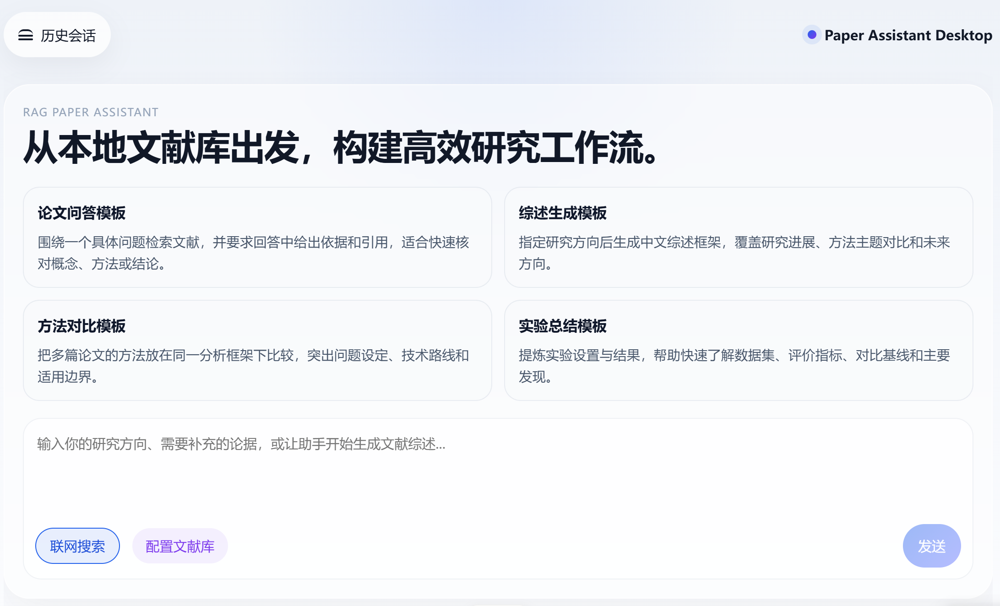</td>
    <td style="border: none;">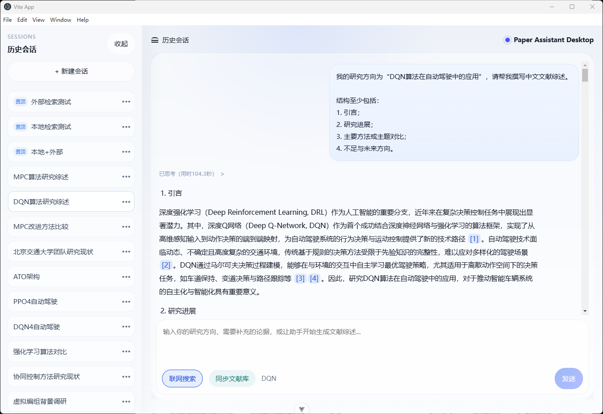</td>
    <td style="border: none;">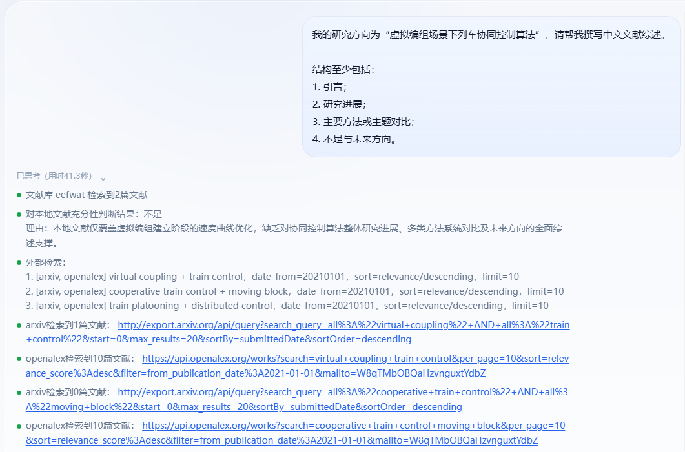</td>
  </tr>
  <tr>
    <td style="border: none;">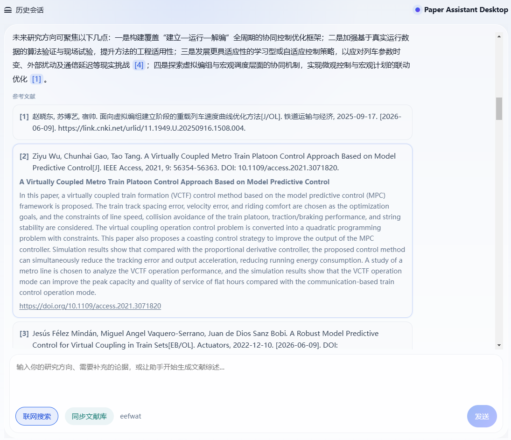</td>
    <td style="border: none;">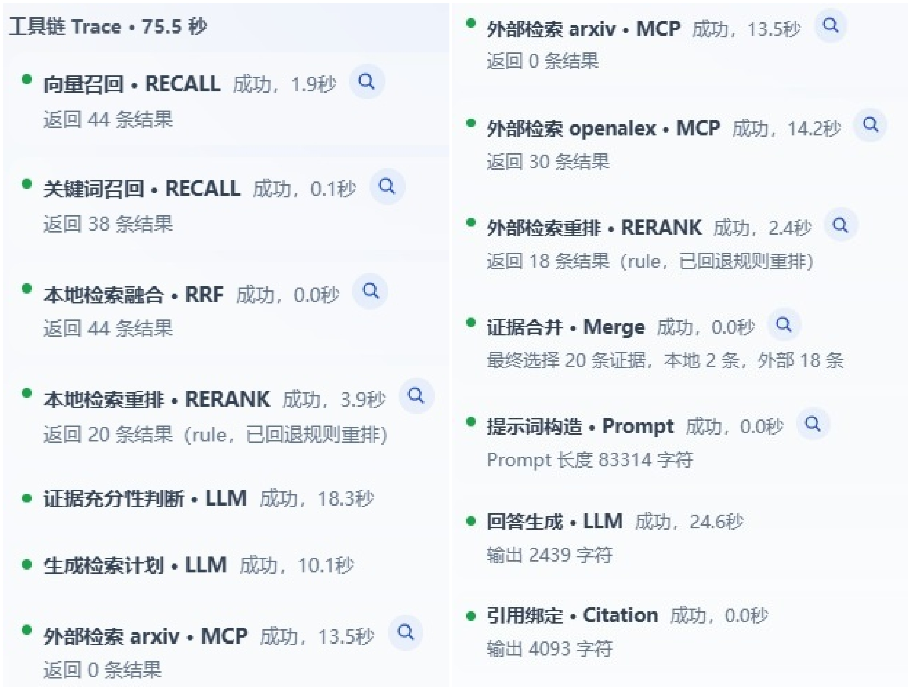</td>
    <td style="border: none;">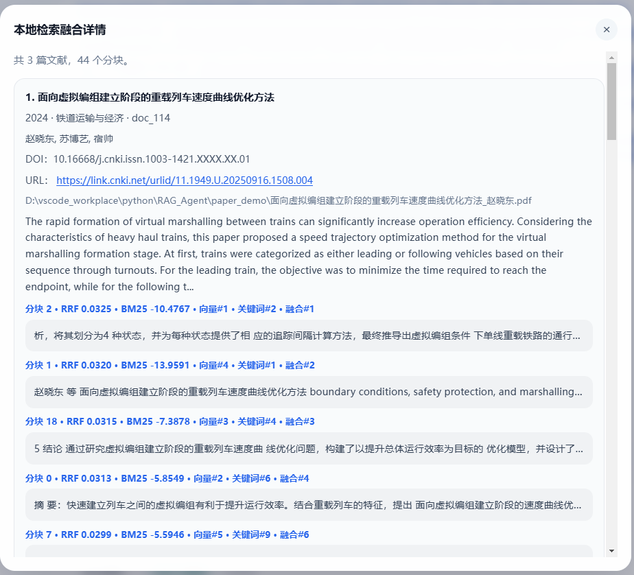</td>
  </tr>
    <tr>
    <td style="border: none;">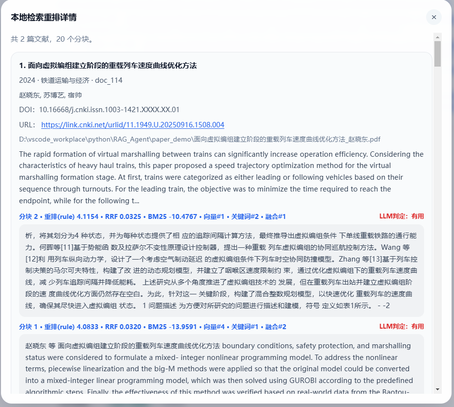</td>
    <td style="border: none;">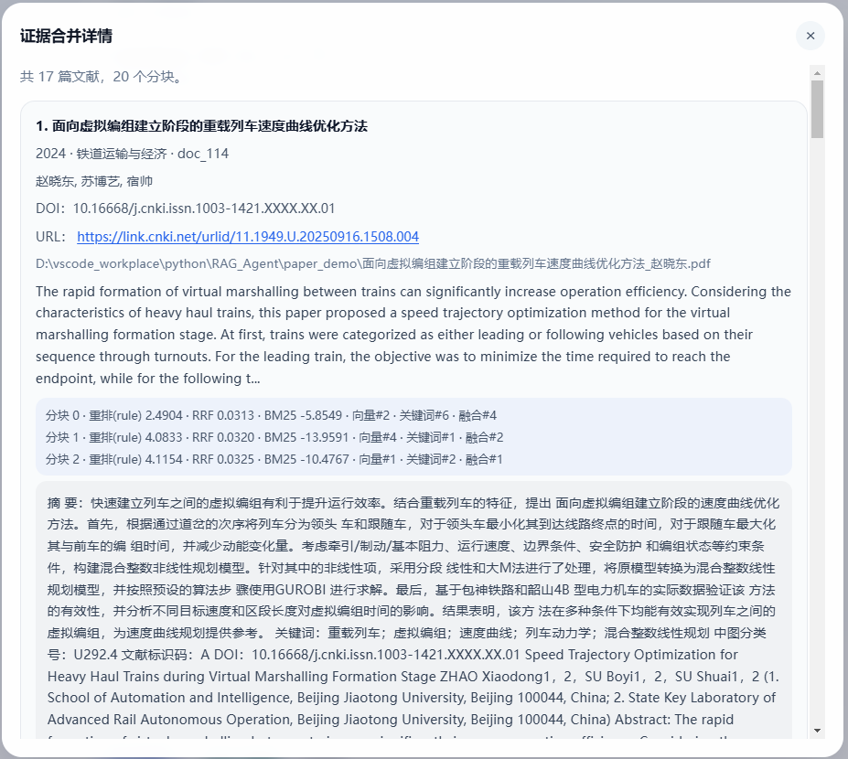</td>
    <td style="border: none;">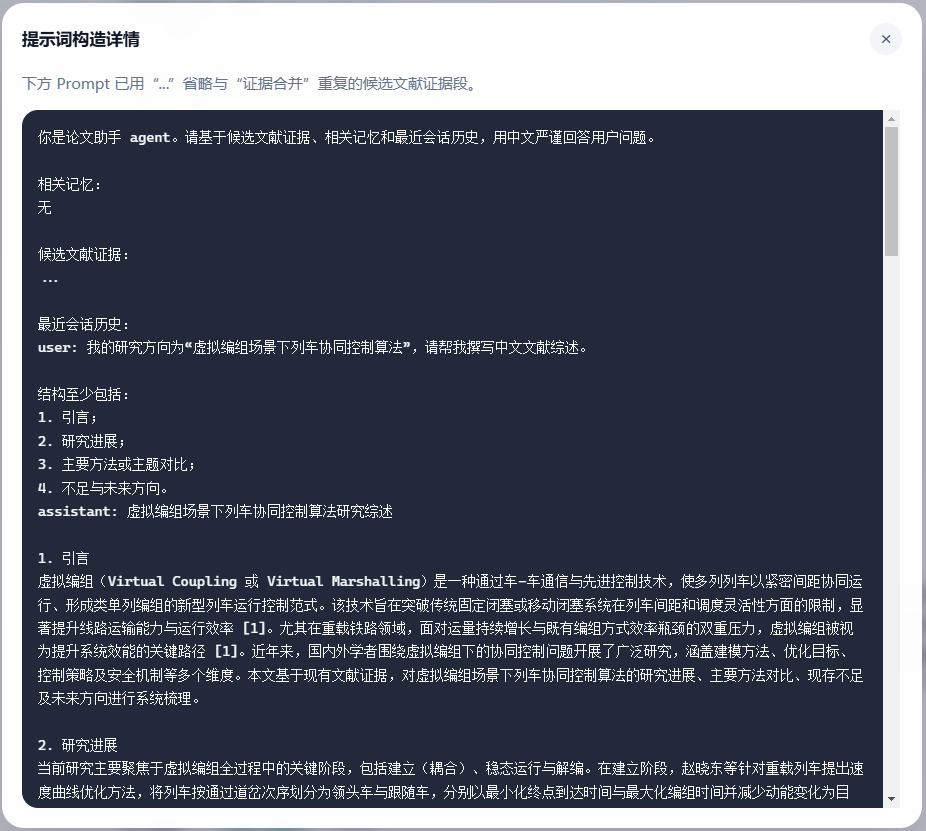</td>
  </tr>
    <tr>
    <td style="border: none;">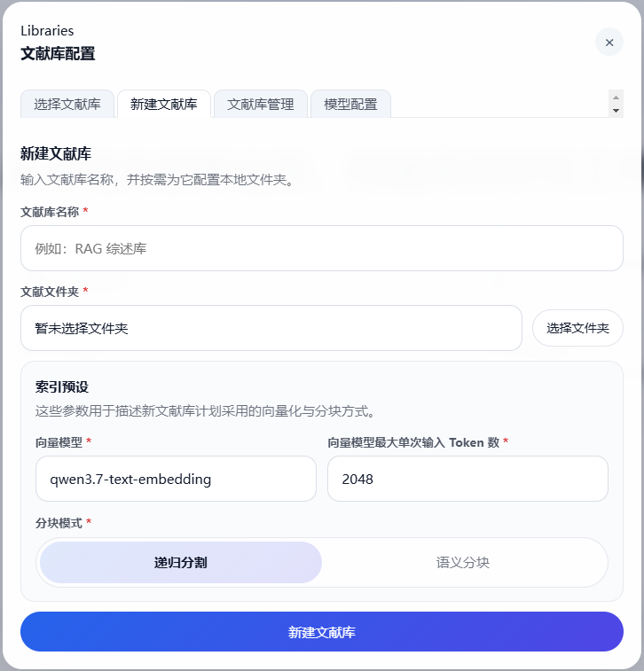</td>
    <td style="border: none;">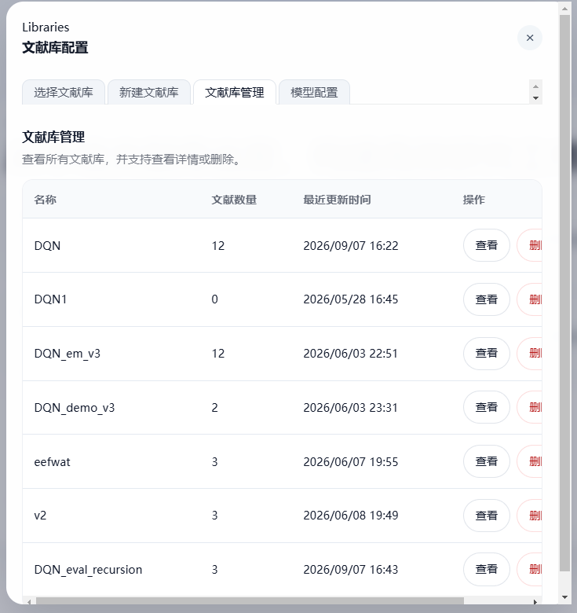</td>
    <td style="border: none;">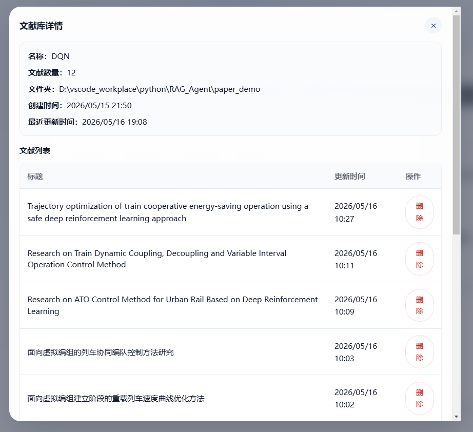</td>
  </tr>
</table>

## 项目结构

```text
.
├─ upload_api.py                # FastAPI 后端入口（uvicorn upload_api:app，默认 127.0.0.1:8000，含 SSE 流式问答）
├─ config_data.py               # 运行目录、检索/重排/并发等默认配置，读取根目录 .env
├─ requirements.txt             # Python 依赖
├─ app_backend/                 # 后端核心
│   ├─ bootstrap.py             #   ServiceContainer 依赖注入装配
│   ├─ db/                      #   SQLite 连接、建表与旧数据自动迁移
│   ├─ models.py                #   领域 dataclass（非 ORM）
│   ├─ repositories/            #   6 个仓储：config/library/document/session/memory/sync
│   ├─ services/                #   解析/分块(递归+语义)/向量索引/关键词检索/重排/元数据提取/Crossref 补全/
│   │                           #   外部检索规划与 MCP 调用/编排与流式对话/同步/记忆/引文格式化…
│   └─ utils/                   #   关键词与 FTS 文本工具
├─ paper_source_mcp_server/     # 独立 MCP 文献检索服务（stdio），暴露 3 个工具，数据源：arXiv、OpenAlex
├─ scripts/                     # 打包脚本（build_backend.ps1：PyInstaller 构建后端可执行文件）
├─ rag-paper-assistant/         # Electron + Vue 3 + Vite + TS 桌面前端
│   ├─ electron/                #   Electron 主进程与 preload（窗口、内置后端进程、文件夹选择 IPC）
│   └─ src/                     #   api/ components/ composables/ types/ utils/ constants/
├─ package.json                 # 根目录脚本代理（dev/build/pack/dist/test… 转发到前端目录）
└─ img/                         # 预览截图
```

## 环境要求

- Python 3.11 或更高版本（PyInstaller 打包后端要求 3.10–3.13）
- Node.js ≥ 20.19（或 ≥ 22.12，由前端 `package.json` engines 声明）
- npm 10 或更高版本

## 后端启动

1. 创建并激活虚拟环境

```powershell
python -m venv .venv
.venv\Scripts\Activate.ps1
```

2. 安装 Python 依赖

```powershell
pip install -r requirements.txt
```

3. 配置模型 API Key 与模型名

运行期使用的 LLM / Embedding / 重排共用同一个 **DashScope（阿里云百炼）API Key**。推荐方式：启动后在界面「文献库 → 模型配置」中填写并保存（会持久化到本地 SQLite `app_config` 表，无需每次设置环境变量）。

项目默认通过 `config_data.py` 读取 `DASHSCOPE_API_KEY` 作为模型 API Key。你可以在系统环境变量中配置，或者在本地 `.env` 文件中配置：

```env
DASHSCOPE_API_KEY=your_api_key_here
```

4. 启动后端服务

```powershell
uvicorn upload_api:app --reload
```

默认地址：

- `http://127.0.0.1:8000`（FastAPI 自带交互式接口文档 `/docs`）

## 前端 / 桌面端启动

> 开发模式下 Electron **不会自动拉起后端**，请先按上文启动后端，再执行：

1. 安装前端依赖

```powershell
cd rag-paper-assistant
npm install
cd ..
```

2. 从项目根目录启动桌面应用

```powershell
npm run dev
```

该命令等价于 `cd rag-paper-assistant && npm run dev`：先启动 Vite 开发服务器（`http://localhost:5173`），再以 `VITE_DEV_SERVER_URL` 拉起 Electron 窗口。仅调试界面时也可直接在浏览器打开 `http://localhost:5173`（前端跨域直连 `127.0.0.1:8000` 后端，后端已放开 CORS）。

常用命令（均在项目根目录执行）：

- `npm run dev`：启动 Electron + Vue 开发环境（需后端已运行）
- `npm run desktop`：以已构建产物启动 Electron
- `npm run build`：前端类型检查 + 构建
- `npm run build:backend`：使用 PyInstaller 构建后端可执行文件（`dist-backend/backend/`）
- `npm run pack`：生成不安装的桌面应用目录
- `npm run dist`：生成 Windows 安装包
- `npm run type-check` / `npm run lint`：前端类型检查 / lint
- `npm run test:unit`：Vitest 单元测试（组件、工具与重构契约测试）
- `npm run test:e2e`：Playwright 端到端测试（mock 后端，断言首页与会话界面结构）

## 数据目录说明

项目运行过程中会在 `config_data.py` 指定的位置创建本地数据目录，用于保存：

- `app_state.db`：SQLite 数据库（文献库、文档、分块、会话、消息、记忆、同步任务，含 FTS5 关键词索引）
- `chroma_db/`：Chroma 向量索引
- `runtime_config.json`、`configured_folders/`：运行时配置与绑定文件夹信息

这些运行产物均已加入 `.gitignore`，不建议提交到 Git 仓库。

## 当前能力说明

**检索链路（单次问答的本地检索）**

1. Chroma 向量召回（每库独立配置 Embedding 模型与最大输入长度）
2. FTS5 + BM25 关键词召回（对标题/摘要/关键词/章节/正文加权）
3. 两路结果做 RRF 融合
4. 本地重排（默认调用百炼 `gte-rerank-v2`，失败自动回退规则重排）
5. top-k 证据进入问答生成

**分块模式**

- 每库可选 `recursive`（递归分割）或 `semantic`（语义分块）
- 语义分块：按页批交给 LLM 识别顶层章节结构（摘要/引言/方法/实验/结论/参考文献…），回到原文定位锚点、合并相邻同类段落后再程序化切分；LLM 失败时自动回退递归分割

**元数据与引文**

- PDF 解析后由规则 + LLM 提取标题/作者/年份/DOI/期刊/文献类型等元数据
- 对最终回答中实际引用的文献自动调用 **Crossref** 在线补全（DOI 精确匹配或标题相似度匹配）
- 全部引用按 **GB/T 7714** 生成引文与文末参考文献列表

**问答与会话**

- SSE 流式回答；回答正文中的 `[n]` 引用编号可点击，下方展示参考文献卡与记忆证据
- 检索「准备区」实时展示召回/覆盖度评估/外部检索计划等步骤
- 每条回答附带 **agent 工具链 trace**（向量召回、关键词召回、RRF、覆盖度评估、检索计划、外部检索、重排、证据合并、生成、引用绑定等 span，可查看命中文档与分块明细）
- 会话支持历史列表、置顶、重命名、绑定文献库；长期记忆按相关性召回作为上下文

**外部文献检索（可选）**

- 输入框左侧可开启外部检索：LLM 先生成检索计划（≤3 路并发、每路 ≤4 个关键词），再由内置 MCP 服务并发查询 **arXiv**（官方 API，自带限速）与 **OpenAlex**（Works API，支持 `OPENALEX_MAILTO`）
- 结果按 DOI / arXiv ID / URL / 标题去重、与本地命中去重后重排，本地证据优先、外部证据补齐（总上限默认 10 条）后统一进入回答
- 该 MCP 服务位于 `paper_source_mcp_server/`，由后端按需以子进程拉起，一般无需手动启动；也可独立运行 `python -m paper_source_mcp_server`（stdio 传输）调试

**模型配置**

- 界面「文献库 → 模型配置」可维护全局 LLM 模型 / API Key / 上下文长度，以及每库的 Embedding 模型、最大输入长度与分块模式；全部持久化到本地 SQLite

## Windows 桌面安装包发布

发布链路说明：

1. 前端使用 Electron + Vite 构建
2. 后端使用 PyInstaller 打包为本地可执行文件（`scripts/build_backend.ps1` → `dist-backend/backend/backend.exe`）
3. electron-builder 将前端产物与后端 exe 一起打进 NSIS 安装包
4. 打包后的应用启动时会自动拉起内置后端，轮询 `GET /health` 就绪后打开窗口，退出时一并关闭后端

首次发布前请先安装依赖：

```powershell
pip install -r requirements.txt
cd rag-paper-assistant
npm install
cd ..
```

然后在项目根目录执行：

```powershell
npm run dist
```

生成结果默认位于：

```text
rag-paper-assistant/release/
```

补充说明：

- 安装包名为 `RAG Paper Assistant-Setup-<版本>.exe`，x64
- 打包版运行数据写入桌面应用的用户数据目录（`backend-data`），而不是安装目录
- 若下载 Electron 二进制较慢，`pack` / `dist` 已内置 npmmirror 镜像配置

## 开发说明

- 后端核心代码位于 `app_backend/`（入口 `upload_api.py`，服务装配见 `app_backend/bootstrap.py`）
- 前端入口链路：`src/main.ts` → `src/App.vue`（薄壳）→ `src/components/app/PaperAssistantPage.vue`；业务状态集中在 `src/composables/usePaperAssistantApp.ts` 及各 `use*` composable，功能组件按 `components/` 下的 chat / library / agent-trace / references / evidence / preparation / history 等目录分区；无 Pinia、无 vue-router
- 前端测试：`npm run test:unit`（Vitest）与 `npm run test:e2e`（Playwright）；后端无独立测试套件
